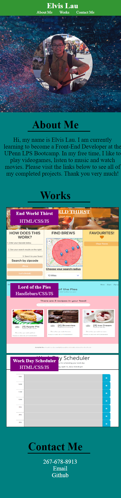

# Portfolio
Temp Portfolio Project

## Description

This portfolio project's purpose was to teach bootcamp students how to build a page from scratch. Students had to design a website that would give a small profile on them, display their past projects that they have worked on, and link to their contact information and social media. 

## Installation

N/A

## Usage

This website has informational sections about me, my works, and my contact information. Clicking on the Navigational bar on top will scroll the page down to each of the above mentioned sections. In the about me section, you will find a small description about me. In the works section, you can click on any of the images or texts to link to any of my works and projects live on my Github pages. Clicking on any of the links in the contact me section will lead you my contact information and Github.

Desktop Site

Mobile Site

<a href="https://github.com/elvislau74/portfolio">Click here for GitHub Repository</a>

<a href="https://elvislau74.github.io/portfolio/">Click here for the Live Site</a>

## Credits

N/A

## License

Please refer to the LICENSE in the repo.